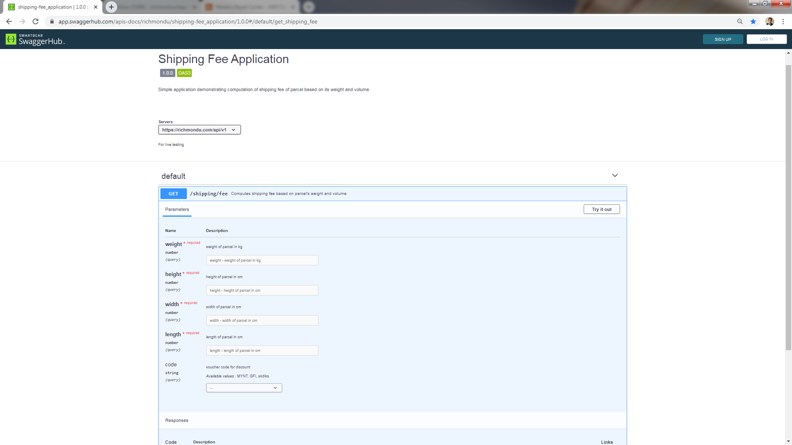

# Shipping Fee Application

Notes: 

- <b>Python</b> was used in this exercise instead of <b>Java</b> due to preference
- But I still designed code to be <b>clean and maintanable</b> by utilizing OOP 
- And more importantly testing the code with <b>unit tests and system tests</b> as well as providing <b>API documentation</b>

To cover up for using Python instead of Java, I've added the following features:

- <b>AWS cloud</b> for live deployment
- <b>Swagger</b> for documentation and system testing
- <b>Jenkins</b> CI/CD for automated build and deployment
- <b>Docker and Docker-Compose</b> for containerization
- <b>Curl</b> batch scripts for automated system testing

Hopefully, there are some business lines which uses Python instead of Java for specific microservices/containers such as Data Analytics related services.

# Requirement

Implement API to compute a parcel cost given its weight and volume based on specific rules and conditions, including discount code from a 3rd party API.

# Design

### Business logic

1. Parcel class

	- This computes the shipping cost given the item's weight and volume.

2. Voucher class

	- This retrieves the percentage discount from a 3rd party API given a voucher code.

3. ShippingFee class

	- This integrates both Parcel and Voucher classes to compute the discounted price.

### Microservices and containerization

1. REST API container

	- This contains the API which calls the main application business logic - ShippingFee class

2. Nginx container

	- Nginx was used instead of AWS ELB for identical setup in local environment to cloud environment

# Unit testing

1. Run unittest.bat. This will run 

	- unittest_parcel.py - test Parcel module
	- unittest_voucher.py - test Voucher module
	- unittest_shipping_fee.py - test Shipping Fee module (uses Parcel and Voucher modules)

# System testing

### How to test using Swagger:

1. Go to https://petstore.swagger.io/

2. In the textbox above, type https://myntshippingfeeapplication.s3.amazonaws.com/swagger_openapi.json

3. Click Explore button.

4. Choose Server

	- local testing - http://127.0.0.1:8000
	- live testing - https://richmondu.com

5. Test the API

	- Click "Try it out" button
	- Input weight, height, width and length
	- Optional: Choose code (voucher code) for discount
	- Click "Execute" button

### How to test using Curl:

1. curl -X GET "https://richmondu.com/api/v1/shipping/fee?code=random&weight=51&height=1&width=1&length=1" -H "accept: application/json"

2. Refer to shipping_application/_curltest for batch scripts for automated system testing

	- test_curl_live.bat
	
		
	
	- test_curl_live_MYNT.bat
	- test_curl_live_GFI.bat
	- test_curl_live_skdlks

# CI/CD

Continuous Integration and Deployment was done using Jenkins which retrieves code from my private Github repository and deploys to AWS EC2 instance

